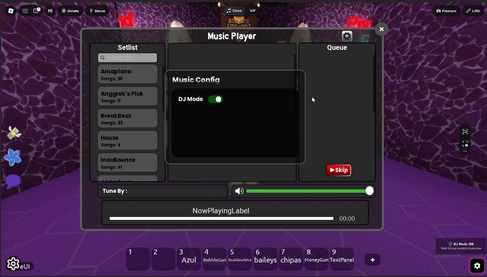
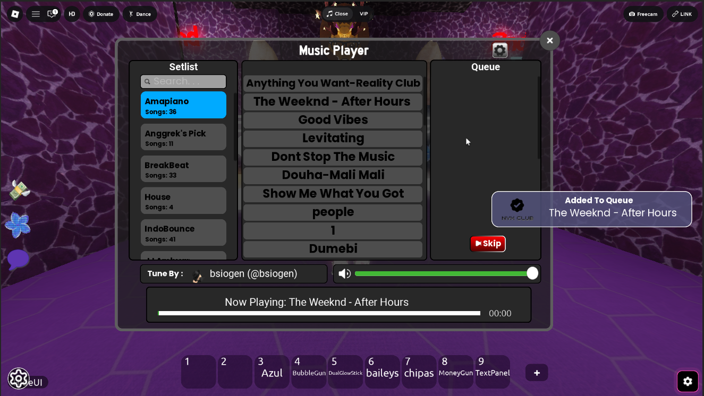
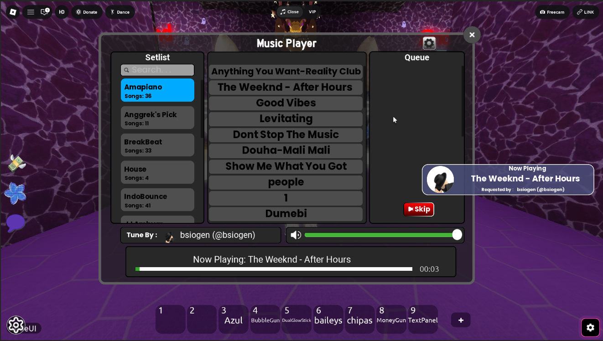
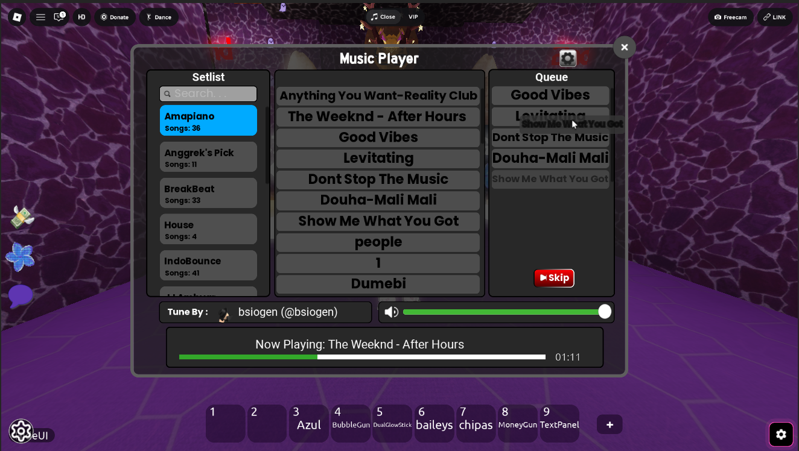
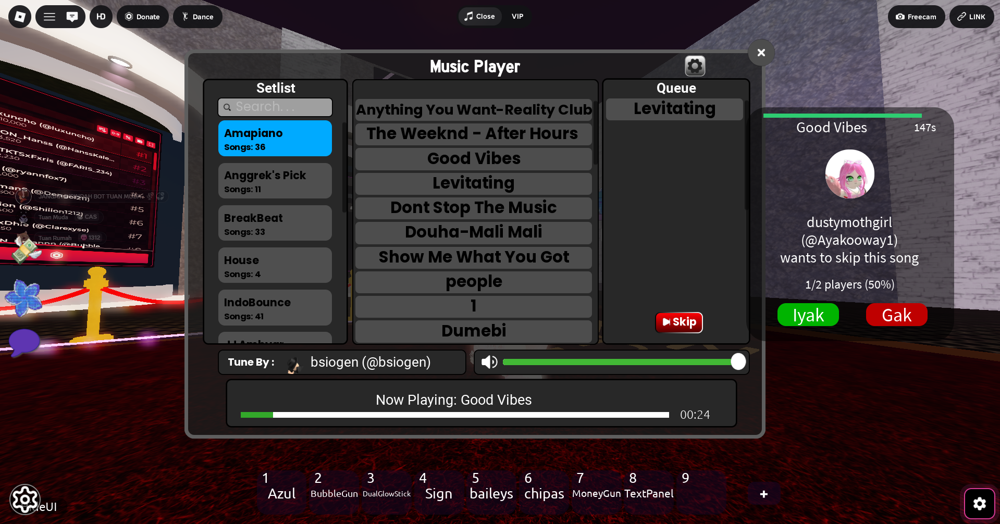
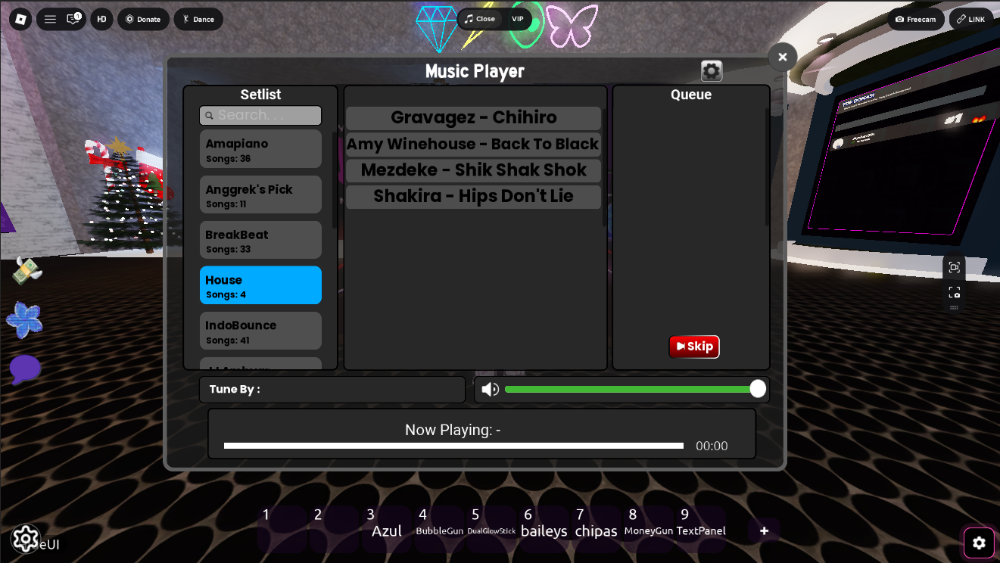

# Roblox GlobalMusicSystem DJ Mode

Sistem musik modular untuk Roblox dengan fitur DJ Mode, realtime queue system, vote skip, dan sinkronisasi multiplayer.

Project ini dibuat untuk kebutuhan game Roblox multiplayer dengan fokus pada pengalaman UI interaktif dan kontrol musik realtime antar player.

---

## Fitur

- DJ Mode system
- Realtime music queue
- Vote skip system
- Playlist browser
- Drag & drop queue
- Toast notification
- Now playing notification
- Multiplayer synchronization
- Modular architecture
- Config & whitelist system
- Smooth UI animation

---

## Teknologi

- Roblox Lua (Luau)
- RemoteEvents
- RemoteFunctions
- TweenService
- Roblox GUI System

---

## Struktur Sistem

```txt
ReplicatedStorage/
├── MusicConfig/
├── MusicEvents/

ServerStorage/
├── Playlists

ServerScriptService/
├── musichandler

StarterGui/
├── MusicGUI
```

---

## Fitur Multiplayer

### DJ Mode
- Hanya player whitelist yang dapat mengontrol musik
- Toggle realtime untuk seluruh player
- Queue protection system

### Vote Skip
- Sistem voting multiplayer
- Majority vote system
- Cooldown protection

### Queue Synchronization
- Sinkronisasi queue realtime antar player
- Update requester & now playing secara langsung

---

## Preview













---

## Catatan

Beberapa object Roblox seperti:
- RemoteEvents
- GUI hierarchy
- UI components

tersimpan di dalam file `.rbxm`.

- Project awalnya dibuat sebagai Roblox marketplace asset
- Fokus utama project adalah modularity dan realtime multiplayer synchronization
- Beberapa asset audio tidak disertakan dalam repository

---

## Dependency

Project ini menggunakan dependency berikut:

### TopbarPlus
Sistem menggunakan library TopbarPlus untuk membuat icon music player pada Roblox topbar.

Library sudah dibundel langsung di dalam file `.rbxm`, sehingga tidak perlu instalasi tambahan.

Credit:
- TopbarPlus by ForeverHD

---

## Catatan Tambahan

Project ini sebelumnya menggunakan:
- whitelist system
- license system
- obfuscated core scripts

untuk kebutuhan distribusi marketplace asset Roblox.

Namun pada repository portfolio ini, fokus utama adalah dokumentasi sistem dan showcase arsitektur project.

---

## Status

Archived / Portfolio Project
